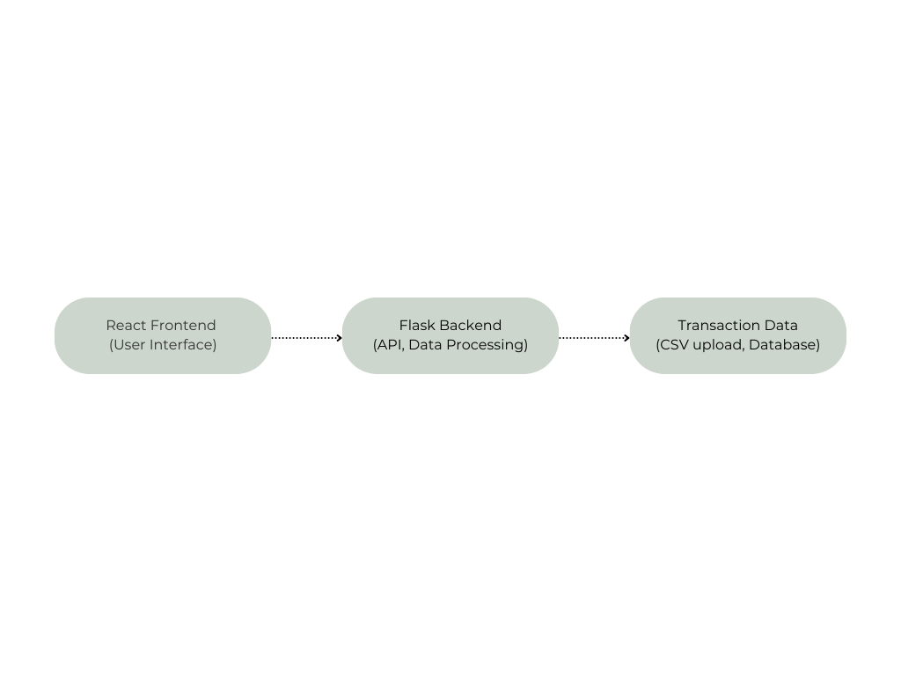
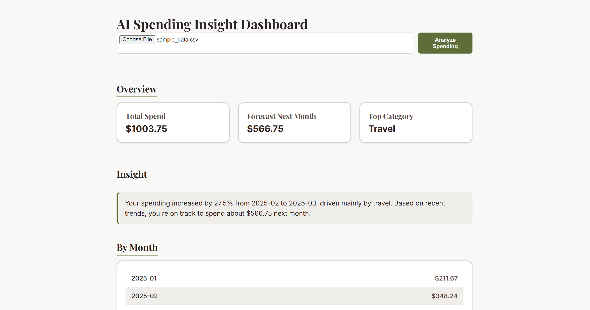
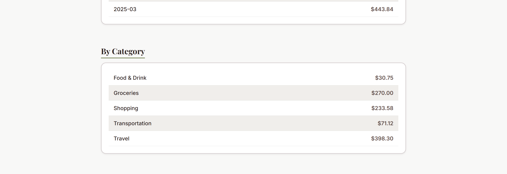

# **AI Spending Dashboard: Executive Summary**

The problem I'm interested in solving is the financial literacy crisis among Americans regarding budgeting and managing personal finances. This dashboard is designed to help students build financial management habits by setting financial goals and tracking spending. This project is an interactive dashboard that analyzes your spending habits using an AI-powered backend built with Flask and a React frontend. It processes transaction data (CSV format) and provides insight into users' financial behavior. This dashboard helps you visualize your total spend, forecast future expenses, and receive personalized insights. It's designed to mitigate the financial literacy gap among young adults by providing an interactive tool for budgeting and financial planning. It can identify where your money is going and give recommendations for how to allocate funds more wisely among different spending categories.

---

## **System Overview:**
* **Course Concept:** Infrastructure: Cloud Services / APIs / Containers - Docker
* **Architecture Diagram:** Here is the architecture diagram that shows how the components of the AI Spending Dashboard interact:
* **Data/Models/Services:** Upload a CSV file with your recent transaction data (Date, Merchant, Category, Amount) with a maximum of 10,000 rows. This project is licensed under the MIT License. The CSV file should be formatted with the following columns: 
   * Date: transaction date (YYYY-MM-DD)
   * Merchant: The name of the merchant where the transaction occurred
   * Category: The spending category (Groceries, Entertainment, Travel, etc)
   * Amount: The amount spent on the transaction
 Frontend to visualize: React and CSS for styling (focusing on a green minimalist design)
 Backend to process: Flask API, Gunicorn, Pandas, Logic for analyzing spending trends
 Deployment: Docker (containerizing both frontend and backend)

---

## **How to Run (Local): Build**

1. Install Docker/ Docker Desktop:
2. 
   * Download from [Docker](https://www.docker.com/products/docker-desktop).
```bash
# build
docker build -t ai-spending-dashboard .
# run
docker run --rm -p 8080:8080 --env-file .env.example ai-spending-dashboard
# health check 
curl http://localhost:8080/health
# clone the repository
git clone https://github.com/xumadison/ai-spending-dashboard.git
cd ai-spending-dashboard
# backend setup
cd backend
python -m venv venv
.\venv\Scripts\activate
pip install -r requirements.txt
python app.py
# frontend setup
cd frontend
npm install
npm run dev
The react app should be running on `http://localhost:5173`
```

---
## **Design Decisions:**
* **Why this concept?** I chose this concept because it aligns with the growing need for financial literacy, especially among students from low-income households who are new to managing their finances. I considered alternatives such as creating a static web page to provide insights for financial tips on purchases. However, decided that this data set dashboard would be more impactful in supporting long-term spending behavior and visualizations.
* **Tradeoffs:** Performance concerns may arise with large datasets (100,000+ rows) due to the Pandas being in memory. It's a cost-effective alternative to purchasing financial management software for bookkeeping and tracking investments by providing an introductory budget/spending platform.
* **Security/Privacy:** Long-term data is not stored on the app and is only used to process insights for the user, and is deleted after.
* **Ops:** Logs are captured for errors in the Flask app; the app could benefit from scaling in case of high traffic, and the app may have performance issues with large CSV files.


---

## **Results & Evaluation**
### **Sample outputs**


* **Validation** Unit tests for backend functionality and sample outputs were validated with manual calculation checks.

---

## **Whats Next**
### **Planned improvements:** 
* Implementation of user authentication to save personal financial data
* More graphics and UI improvements
* Add a recommendation engine or chat bot to personalize financial advice
* STRETCH: Enhance the forecasting model for ARIMA or LSTM models for better accuracy

---

## **Links**
GitHub Repo: https://github.com/xumadison/ai-spending-dashboard.git

## License
This project is licensed under the MIT License - see the [LICENSE](./LICENSE) file for details.


